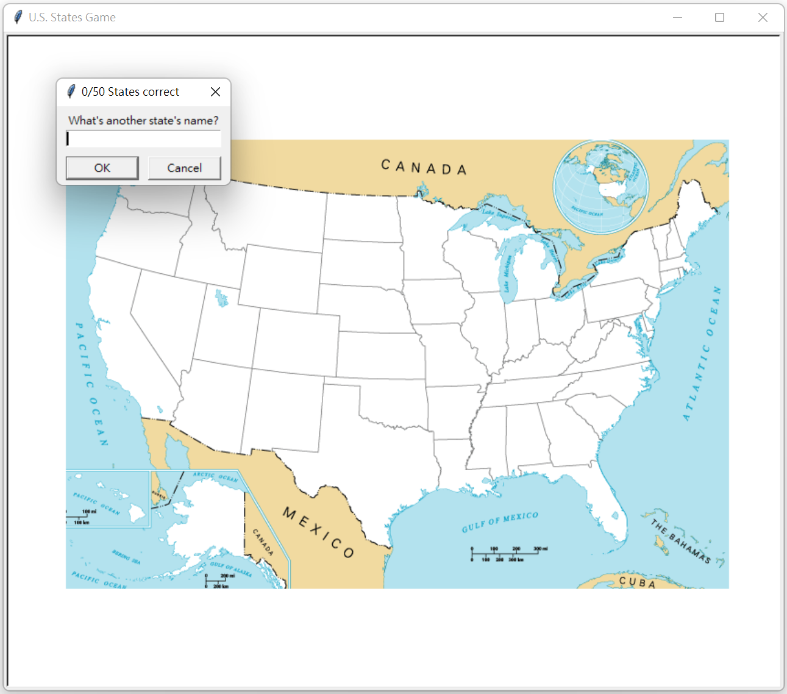
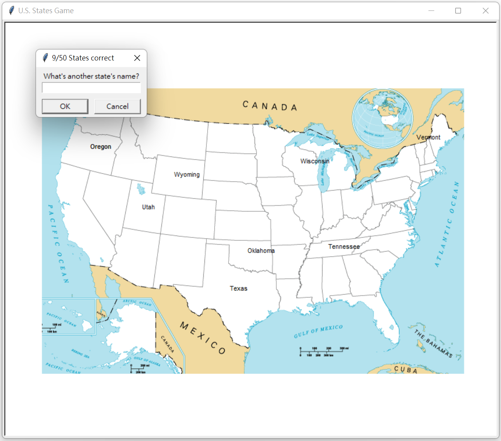

# <Strong>_Description_</Strong>

This is a educational and interesting game, which gets you to guess and learn all of the States in the US. It's all blank until you start guessing some States, and then you keep going until you've managed to get all 50. This game tests you on your knowledge of the names of the 50 States in the US.
 

# <Strong>_Tools & Git page_</Strong>

 
 
<strong>Git page: **https://github.com/LeonTsai2021 **</strong> 
 

 

# <Strong>_Features_</Strong>

## <Strong>_Home_</Strong>
When your answer is correct, the State would show on the picture. The top of input screen shows the number of the States you have figured out. 

## <Strong>_Guess_</Strong>
There is'nt necessary for you to write uppercase letter beginning. The program would automatically transform it.

 
